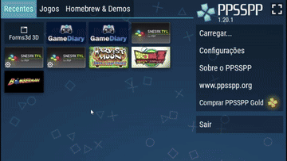

# PSP-Square3D

  

A small 3D playground for the PSP, built to understand how the console handles rendering and audio at a lower level.

The main goal of this project is to experiment with both **software rendering (SDL2)** and the PSP’s native **GU (Graphics Utility)**, with the ability to switch between them in real time and compare behavior and performance.

This isn’t meant to be a polished engine — it’s more of a hands-on exploration of the PSP SDK and how things work under the hood.

---

## Features

* Basic 3D rendering (Cube, Pyramid, Sphere)
* Runtime backend switching (SDL2 ↔ PSP GU)
* Simple audio playback (WAV streaming)
* On-screen logger
* Basic FPS counter

---

## Controls

* **Cross (X)** — Switch rendering backend
* **Triangle** — Change color
* **Square** — Change geometry
* **Circle** — Toggle wireframe / solid
* **D-Pad** — Rotate object (with inertia)
* **Select** — Exit

---

## Notes

This project was built using a more “vibe coding” approach — experimenting, testing ideas, and learning along the way rather than following a strict architecture.

The focus is on understanding how the PSP behaves internally, especially when comparing software and hardware rendering paths.

---

## Purpose

To get a better grasp of:

* PSP rendering pipeline
* Differences between CPU and GPU rendering
* Low-level audio handling
* General performance characteristics of the hardware

